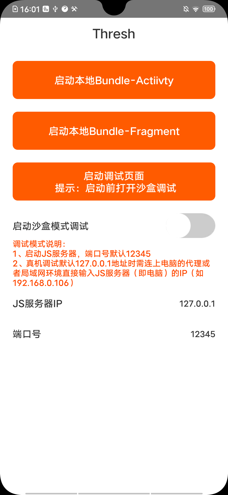
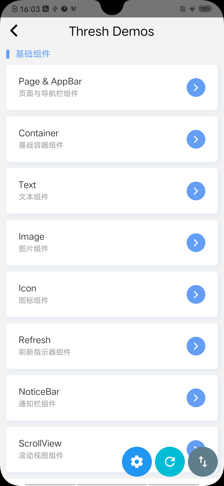
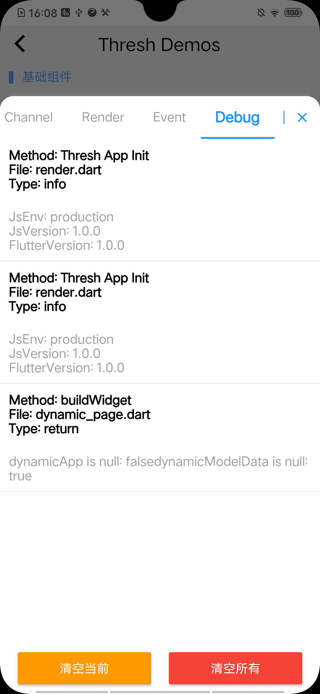
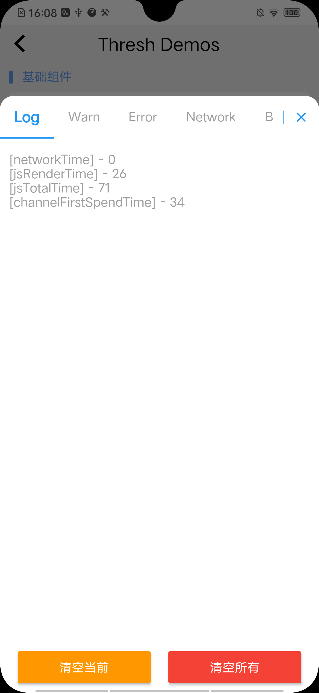

# 调试工具说明

> 目前thresh调试模式，支持热重载和safari浏览器debug 断点模式，下面主要介绍目前的热重载方式

### 1、热重载【hot reload】

示意图如下：

​	     

hot reload分为本地调试和远程JS服务器调试

本地调试：直接加载本地的bundle包 

远程JS服务器调试：加载服务端最新生成的bundle包

#### 调试面板说明

工具栏：主要用于记录业务开发或thresh的打点选项

Log ： 		  记录通用log
Warn ：		警告日志
Error ： 		错误 级别日志
Network ：   网络日志
Bridge ：       bridge日志
Channel：     flutter & native channel通信日志
Render :        页面渲染日志
Event ：        记录消息事件以及生命周期事件
Debug ：      本地debug日志

刷新按钮：页面重新加载，能实时拉取最新改动的bundle包，所见即所得

### 2、使用 Mac Safari 调试 Thresh App

当你使用 Mac 电脑与 iOS 设备进行 Thresh App 的开发时，你可以借助 Mac Safari 浏览器获得更加便捷的 Thresh App 调试体验！

#### 启用调试的前置操作

首先，你需要先打开 Safari 浏览器，然后通过顶部菜单「Safari浏览器」打开「偏好设置」菜单，并切换到「高级」选项卡中，将「高级」选项卡底部的「在菜单栏中显示开发菜单」勾选上。

 

然后，进入调试设备（真机或模拟器）的「设置」应用，通过「Safari - 高级/Advanced」进入高级设置项中，开启「Web检查器/Web Inspector」

 

### 开始调试

如果你使用的是真机，你还需要将设备通过 USB 连接到你的 Mac 上。完成以上操作后，你就已经具备了使用 Safari 调试的条件。

>有以下两点需要注意：
>
>1. 请在打开模拟器或连接真机之前打开 Mac Safari，否则 Safari 会无法连接到调试设备；
>2. 对于 iOS14 的设备，Mac 的系统必须是 macOS Big Sur，即 11.0 版本即以上才可以进行调试。

点击 Safari 菜单栏中的 「开发」选项，如果你的设备已经成功连接到 Safari，「开发」选项中将会出现你的设备名称，点击你的设备名称，会出现该设备上运行的可被发现的 JSContext。

 

> 如未发现设备，请检查前置操作是否已完成，或者断开设备/关闭模拟器后重新连接/启动模拟器。

如果没有 JSContext 存在，你可以先运行 Thresh App 后再来查看。点击 JSContext 即可打开其对应的控制台界面。你也可以将「自动显示 JSContext 的网页检查器」勾选上，这样当你刷新 Thresh App 或重新运行时，只要连接未断开，Safari 将会自动为你打开控制台界面。

 

> 如果你的应用中存在多个 JSContext，那你可能需要在多个 JSContext 中找到 Thresh App 所对应的那个。

### 编写调试代码

Thresh 已经为你提供了一套方便使用的调试 Api，你可以通过 `Util.log()` `Util.warn()` 及 `Util.error()` 同时在控制台及 Thresh App 的调试面板中输出调试信息。这些方法是安全的，不会导致 Thresh App 程序报错。

>  `Util.error()` 在 Thresh App 中会主动唤起 Error 调试面板，但这并不是程序报错，而是为了提醒开发者注意。
>
>  当程序报错时，Error 调试面板也会被主动唤起以显示报错信息，你也可以在控制台中查看报错信息并定位到具体代码。

需要注意的是，如果你依然习惯使用 `console.xxx()` ，那我们建议你在提交代码之前将这些调试代码移除，否则在安卓上使用除 `console.log()` 以外的其他方法都会导致 Thresh App 程序报错。

